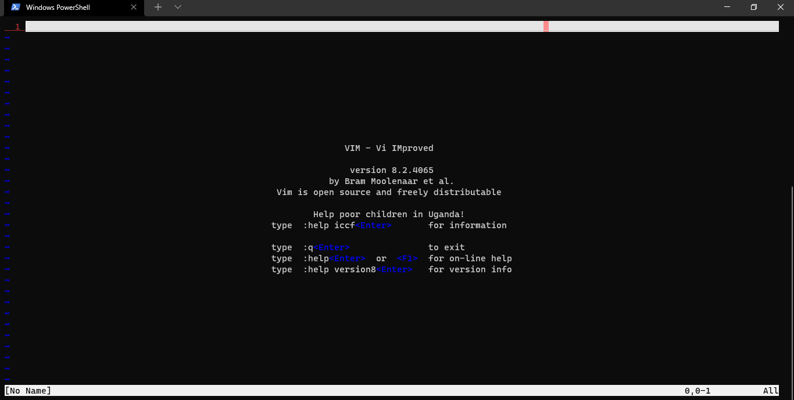

# Vim 8 Python3 Build.

__Vim 8 Editor build with python3 support. Using Alpine OS with python3.10, and a docker image.__


## Installation from Docker.

```bash
$ docker run -it --name vim eduarddan/vim-python3-build
```

## Use.

__After of get the image and run a container, you can execute:__

```bash
$ vim
```

__Now you can make sure that it is compiled with python3:__

```bash
$ vim --version | grep python
```



_Now your vim editor have python3 support, util for install plugins._